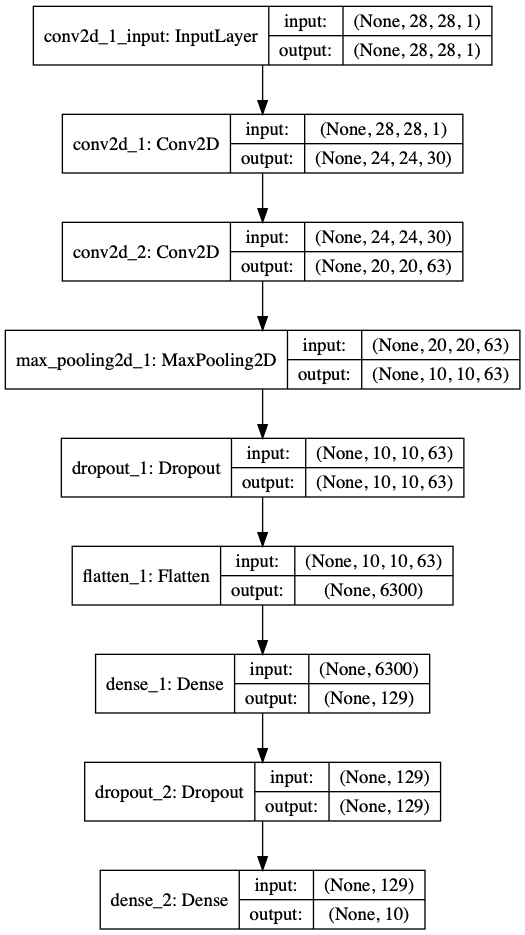

# 2-Layer Convolutional Neural Network (CNN) with Genetic Algorithm (GA) Keras Implementation

This is a tutorial for how GA finds the optimum parameters for the designed model

## Model

The model is inspired from the [Keras Mnist implementation](https://github.com/keras-team/keras/blob/master/examples/mnist_cnn.py)



## Genetic Algorithm Approach

A) Chromosome (Network) representation: Initializing the genes randomly

The genes are below:

1. epoch
2. filter size 1
3. filter size 2
4. neuron number (unit)
5. kernel size 1
6. kernel size 2
7. dropout 1
8. dropout 2
9. activation 1
10. activation 2
11. activation 3
12. activation 4
13. loss function
14. optimization


```python
class Net:
    def __init__(self):
        self.ep = randint(1, 3)               # epoch
        self.f1 = randint(30, 34)             # filter size 1
        self.f2 = randint(62, 66)             # filter size 2
        self.u1 = randint(126, 130)           # unit
        self.k1 = choice([(3, 3), (5, 5)])    # kernel size 1
        self.k2 = choice([(3, 3), (5, 5)])    # kernel size 2
        self.d1 = choice([0.25, 0.5])         #  dropout 1
        self.d2 = choice([0.25, 0.5])         #  dropout 2
        self.a1 = 'relu'                      # activation 1
        self.a2 = 'relu'                      # activation 2
        self.a3 = 'relu'                      # activation 3
        self.a4 = 'softmax'                   # activation 4
        self.lf = 'categorical_crossentropy'  # loss function
        self.op = 'adadelta'                  # optimization
        self.ac = 0                           # accuracy
```

B) Fitness function: Each Initialized Chromosome (Network) accuracy

```python
s = m.evaluate(x=x_test, y=y_test, verbose=0)
i.ac = s[1]
print('Accuracy: {}'.format(i.ac * 100))
```

C) Selection: Selecting the highest accuracy Chromosomes (Networks)

```python
n = sorted(n, key=lambda j: j.ac, reverse=True)
n = n[:int(len(n))]
```

D) Crossover: Creating the new childs (networks) using the selected best N networks

```python
p1 = choice(n)
p2 = choice(n)
c1 = Net()
c2 = Net()
c1.ep = int(p2.ep) + 2
c2.ep = int(p1.ep) + 2
```

E) Mutation: Randomly changing genes (Epoch and neurons)

```python
for i in n:
    if uniform(0, 1) <= 0.1:
        i.ep += randint(0, 5)
        i.u1 += randint(0, 5)
```

F) Termination criteria: If the new child network accuracy is higher than the threshold accuracy stop.

```python
for q in N:
    accuracy_list.append(q.ac * 100)
    if q.ac > T:
        print('Threshold satisfied')
        print(q.init_params())
        print('Best accuracy: {}%'.format(q.ac * 100))
        exit(code=0)
```

:thought_balloon:

## Contributing
Pull requests are welcome.

For major changes, please open an issue, then discuss what you would like to change.

## License
[MIT](https://choosealicense.com/licenses/mit/)
